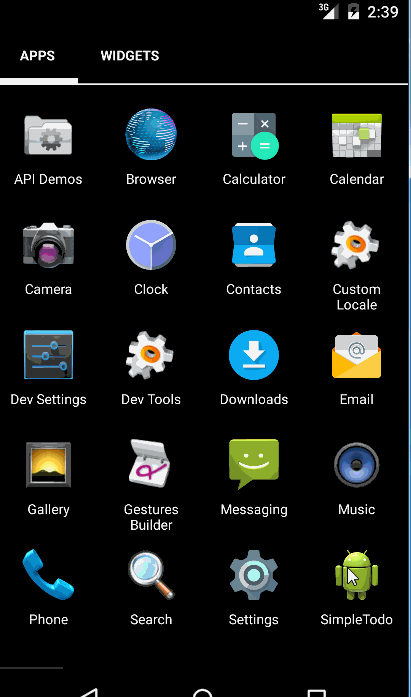

# SimpleTodo Demo

This is an Android demo application for simple TODO list. See the [CodePath Pre-work](http://courses.codepath.com/snippets/intro_to_android/prework) for a step-by-step tutorial.

Time spent: 4 hours spent in total

Completed user stories:

 * [x] Required: User can view a list of todo items and can add, remove items from the todo list.
 * [x] Required: User can click on a todo item in the list to bring up a new activity to edit and save item.
 * [x] Required: User's todo items are persisted in a file and is retrieved on app restart. 
 
Notes:

Spent some time on adding .gitignore file.

Walkthrough of all user stories:

 

GIF created with [LiceCap](http://www.cockos.com/licecap/).

